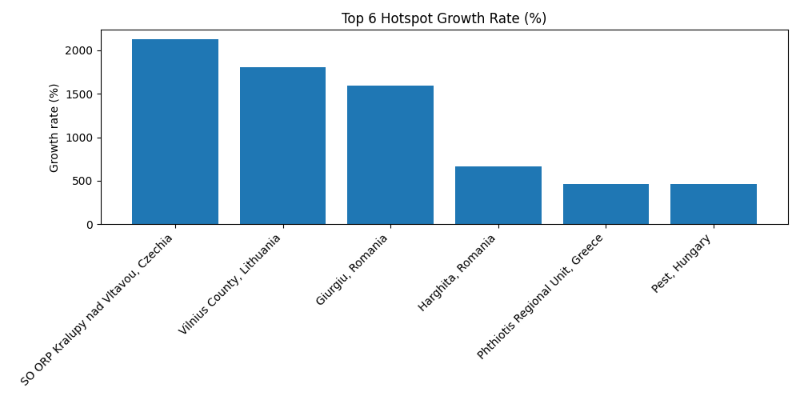

# REGIONÁLIS BIZTONSÁGPOLITIKAI HELYZETJELENTÉS
# REGIONAL SECURITY SITUATION REPORT

## Visual Overview

### Top Hotspot Growth Rate

Balkán – Közép- és Kelet-Európa – Közel-Kelet  
Balkans – Central and Eastern Europe – Middle East  

Készítés dátuma: 2026-03-09  
Date of issue: 2026-03-09  

Terjesztés: Nyilvános elemzés  
Distribution: Public analysis  

Készítette: toresvonalak.blog  
Prepared by: toresvonalak.blog  

---

# 1. Vezetői összefoglaló  
## Executive Summary

Az elmúlt időszak fejleményei arra utalnak, hogy a megfigyelt régiókban továbbra is fennmaradnak a biztonsági kockázatok, különösen a regionális politikai feszültségek, a határmenti incidensek és a Közel-Kelethez kapcsolódó stratégiai bizonytalanság tekintetében.

A monitoring rendszer az aktuális időszakban **3543 biztonsági relevanciájú eseményt** azonosított a vizsgált térségekben.

A jelenlegi trendek alapján valószínűsíthető, hogy a Balkán és a közép- és kelet-európai térségben alacsony intenzitású, de tartós biztonsági incidensek maradnak jelen, míg a Közel-Kelet továbbra is jelentős politikai, gazdasági és stratégiai kockázati forrásként értékelhető.

Bár közvetlen, nagyszabású katonai konfliktus nem minden térségben várható, a helyzet továbbra is fokozott figyelmet igényel a regionális biztonságpolitikai döntéshozók részéről.

Recent developments indicate that security risks remain present across the monitored regions, particularly with regard to political tensions, localized incident activity and persistent strategic uncertainty linked to the Middle East.

The monitoring system identified **3543 security-relevant items** across the currently integrated regional streams.

Current trends suggest that low-intensity but persistent security incidents are likely to remain present in the Balkans and in Central and Eastern Europe, while the Middle East continues to represent a significant source of political, economic and strategic risk.

While direct large-scale military confrontation is not assessed as imminent across all theatres, the overall environment still requires heightened analytical attention.

---

# 2. Aktuális biztonsági helyzet  
## Current Security Situation

### Politikai környezet / Political Environment

A térség politikai rendszerei jelenleg relatív stabilitást mutatnak, ugyanakkor több országban megfigyelhető a politikai polarizáció erősödése és a társadalmi mobilizáció növekedése.

The political systems of the monitored regions currently show relative institutional stability, although political polarization and social mobilization are visible in several countries.

### Katonai és biztonsági helyzet / Military and Security Situation

Balkán régióban azonosított események száma: **476**  
Közép- és Kelet-Európában azonosított események száma: **2840**  
Közel-Kelethez kapcsolódó azonosított események száma: **227**

Az incidensek többsége alacsony intenzitású eseményekhez, politikai feszültségekhez vagy biztonsági incidensekhez kapcsolódik, miközben a közel-keleti adatfolyam jelentős részben hír alapú regionális fejleményeket követ.

Most detected items remain linked to low-intensity security developments, political tensions or localized incident clusters, while the Middle East data stream is largely driven by news-based regional developments.

### Közel-Kelet / Middle East

A monitoring rendszer az aktuális időszakban **227 közel-keleti eseményt** azonosított. Az események túlnyomó része hírforrásokon alapuló regionális jelzésként értelmezhető.

The monitoring system identified **227 Middle East-related events** in the current dataset. Most items can be interpreted as news-based regional signals.

#### Kiemelt események / Highlighted events

**Iran Update Evening Special Report, March 8, 2026**  
Dátum: **2026-03-08** | Helyszín: **Israel** | Forrás: **ISW**  
Az esemény általános monitoring jelzés kategóriába sorolható, és a monitoring rendszer 0.78 bizalmi szint mellett kezelte. A rendelkezésre álló összefoglaló alapján ez egy **regionális fejlemény**, amely hozzájárul a térség folyamatos stratégiai bizonytalanságához. The Institute for the Study of War (ISW) and the Critical Threats Project (CTP) at the American Enterprise Institute are publishing two updates daily to provide analysis on the war with Iran. The morning update will focus on US and Israeli strikes on Iran and Iran and the Axis of Resistance’s response to the strikes. The evening update...

**Iran Update Evening Special Report, March 8, 2026**  
Date: **2026-03-08** | Location: **Israel** | Source: **ISW**  
This event can be classified as a general monitoring signal, and it was handled by the monitoring system with a confidence level of 0.78. Based on the available summary, this is a **military** development contributing to the region's continued strategic uncertainty. The Institute for the Study of War (ISW) and the Critical Threats Project (CTP) at the American Enterprise Institute are publishing two updates daily to provide analysis on the war with Iran. The morning update will focus on US and Israeli strikes on Iran and Iran and the Axis of Resistance’s response to the strikes. The evening update...

**Iran Update Morning Special Report, March 8, 2026**  
Dátum: **2026-03-08** | Helyszín: **Israel** | Forrás: **ISW**  
Az esemény általános monitoring jelzés kategóriába sorolható, és a monitoring rendszer 0.78 bizalmi szint mellett kezelte. A rendelkezésre álló összefoglaló alapján ez egy **regionális fejlemény**, amely hozzájárul a térség folyamatos stratégiai bizonytalanságához. The Institute for the Study of War (ISW) and the Critical Threats Project (CTP) at the American Enterprise Institute are publishing two updates daily to provide analysis on the war with Iran. The morning update will focus on US and Israeli strikes on Iran and Iran and the Axis of Resistance’s response to the strikes. The evening update...

**Iran Update Morning Special Report, March 8, 2026**  
Date: **2026-03-08** | Location: **Israel** | Source: **ISW**  
This event can be classified as a general monitoring signal, and it was handled by the monitoring system with a confidence level of 0.78. Based on the available summary, this is a **military** development contributing to the region's continued strategic uncertainty. The Institute for the Study of War (ISW) and the Critical Threats Project (CTP) at the American Enterprise Institute are publishing two updates daily to provide analysis on the war with Iran. The morning update will focus on US and Israeli strikes on Iran and Iran and the Axis of Resistance’s response to the strikes. The evening update...

**Iran Update Evening Special Report, March 7, 2026**  
Dátum: **2026-03-07** | Helyszín: **Israel** | Forrás: **ISW**  
Az esemény általános monitoring jelzés kategóriába sorolható, és a monitoring rendszer 0.78 bizalmi szint mellett kezelte. A rendelkezésre álló összefoglaló alapján ez egy **regionális fejlemény**, amely hozzájárul a térség folyamatos stratégiai bizonytalanságához. The Institute for the Study of War (ISW) and the Critical Threats Project (CTP) at the American Enterprise Institute are publishing two updates daily to provide analysis on the war with Iran. The morning update will focus on US and Israeli strikes on Iran and Iran and the Axis of Resistance’s response to the strikes. The evening update...

**Iran Update Evening Special Report, March 7, 2026**  
Date: **2026-03-07** | Location: **Israel** | Source: **ISW**  
This event can be classified as a general monitoring signal, and it was handled by the monitoring system with a confidence level of 0.78. Based on the available summary, this is a **military** development contributing to the region's continued strategic uncertainty. The Institute for the Study of War (ISW) and the Critical Threats Project (CTP) at the American Enterprise Institute are publishing two updates daily to provide analysis on the war with Iran. The morning update will focus on US and Israeli strikes on Iran and Iran and the Axis of Resistance’s response to the strikes. The evening update...

---

# 3. Geopolitikai környezet  
## Geopolitical Environment

A térség geopolitikai jelentősége elsősorban abból fakad, hogy több stratégiai jelentőségű energia-, kereskedelmi és politikai útvonal metszéspontjában helyezkedik el.

A jelenlegi geopolitikai dinamikát a nagyhatalmi versengés, a regionális biztonsági architektúra változásai és a gazdasági stabilitás kérdései alakítják.

The geopolitical relevance of the broader area stems primarily from its location along strategic energy, trade and political corridors.

Current regional dynamics are shaped by great-power competition, changing security architectures and questions of economic resilience.

---

# 4. Fő biztonsági kihívások  
## Main Security Challenges

A legjelentősebb kockázatot jelenleg az jelenti, hogy több térségben egyszerre jelentkeznek politikai, gazdasági és biztonsági természetű kihívások.

A térségben az utóbbi időszakban erősödtek a hibrid hadviselés elemei, különösen az információs műveletek és a kibertérhez kapcsolódó sérülékenységek területén.

The most significant current risk lies in the simultaneous presence of political, economic and security pressures across multiple monitored areas.

Hybrid elements have also become more visible, especially in the field of information influence and cyber-related vulnerabilities.

---

# 5. Regionális hotspotok  
## Regional Hotspots

### Balkán
**Regional Unit of East Attica, Greece**  
Az elmúlt időszak fejleményei arra utalnak, hogy Regional Unit of East Attica, Greece térségében növekvő incidensaktivitás figyelhető meg. A monitoring rendszer kiemelkedően magas eseménysűrűséget azonosított, az aktivitásváltozás mértéke pedig 218.9%. A jelenlegi jelzések elsődlegesen hír- és médiamonitoring alapú incidensjelzés formájában jelentkeznek.  
Jelzés típusa: **Politikai / biztonsági incidensjelzés**. A jelenlegi trendek alapján valószínűsíthető, hogy a térség rövid távon is a regionális figyelem egyik fontos pontja marad. A hotspot intenzitási pontszáma: **28.788**.

**Regional Unit of East Attica, Greece**  
Recent developments suggest that an upward trend in incident activity can be observed in the Regional Unit of East Attica, Greece area. The monitoring system detected a particularly high event density, while the change in activity reached 218.9%. Current signals are primarily identified as news and media monitoring-based signal.  
Signal type: **Politikai / biztonsági incidensjelzés**. Current trends suggest that this location is likely to remain an important focal point of regional monitoring in the short term. Hotspot intensity score: **28.788**.

**Phthiotis Regional Unit, Greece**  
Az elmúlt időszak fejleményei arra utalnak, hogy Phthiotis Regional Unit, Greece térségében növekvő incidensaktivitás figyelhető meg. A monitoring rendszer jelentős eseménysűrűséget azonosított, az aktivitásváltozás mértéke pedig 355.4%. A jelenlegi jelzések elsődlegesen hír- és médiamonitoring alapú incidensjelzés formájában jelentkeznek.  
Jelzés típusa: **Politikai / biztonsági incidensjelzés**. A jelenlegi trendek alapján valószínűsíthető, hogy a térség rövid távon is a regionális figyelem egyik fontos pontja marad. A hotspot intenzitási pontszáma: **17.550**.

**Phthiotis Regional Unit, Greece**  
Recent developments suggest that an upward trend in incident activity can be observed in the Phthiotis Regional Unit, Greece area. The monitoring system detected a significant event density, while the change in activity reached 355.4%. Current signals are primarily identified as news and media monitoring-based signal.  
Signal type: **Politikai / biztonsági incidensjelzés**. Current trends suggest that this location is likely to remain an important focal point of regional monitoring in the short term. Hotspot intensity score: **17.550**.

**Harghita, Romania**  
Az elmúlt időszak fejleményei arra utalnak, hogy Harghita, Romania térségében növekvő incidensaktivitás figyelhető meg. A monitoring rendszer jelentős eseménysűrűséget azonosított, az aktivitásváltozás mértéke pedig 432.5%. A jelenlegi jelzések elsődlegesen hír- és médiamonitoring alapú incidensjelzés formájában jelentkeznek.  
Jelzés típusa: **Politikai / biztonsági incidensjelzés**. A jelenlegi trendek alapján valószínűsíthető, hogy a térség rövid távon is a regionális figyelem egyik fontos pontja marad. A hotspot intenzitási pontszáma: **15.974**.

**Harghita, Romania**  
Recent developments suggest that an upward trend in incident activity can be observed in the Harghita, Romania area. The monitoring system detected a significant event density, while the change in activity reached 432.5%. Current signals are primarily identified as news and media monitoring-based signal.  
Signal type: **Politikai / biztonsági incidensjelzés**. Current trends suggest that this location is likely to remain an important focal point of regional monitoring in the short term. Hotspot intensity score: **15.974**.

### Közép- és Kelet-Európa
**SO ORP Kralupy nad Vltavou, Czechia**  
Az elmúlt időszak fejleményei arra utalnak, hogy SO ORP Kralupy nad Vltavou, Czechia térségében növekvő incidensaktivitás figyelhető meg. A monitoring rendszer kiemelkedően magas eseménysűrűséget azonosított, az aktivitásváltozás mértéke pedig 4445.2%. A jelenlegi jelzések elsődlegesen hír- és médiamonitoring alapú incidensjelzés formájában jelentkeznek.  
Jelzés típusa: **Politikai / biztonsági incidensjelzés**. A jelenlegi trendek alapján valószínűsíthető, hogy a térség rövid távon is a regionális figyelem egyik fontos pontja marad. A hotspot intenzitási pontszáma: **465.927**.

**SO ORP Kralupy nad Vltavou, Czechia**  
Recent developments suggest that an upward trend in incident activity can be observed in the SO ORP Kralupy nad Vltavou, Czechia area. The monitoring system detected a particularly high event density, while the change in activity reached 4445.2%. Current signals are primarily identified as news and media monitoring-based signal.  
Signal type: **Politikai / biztonsági incidensjelzés**. Current trends suggest that this location is likely to remain an important focal point of regional monitoring in the short term. Hotspot intensity score: **465.927**.

**Giurgiu, Romania**  
Az elmúlt időszak fejleményei arra utalnak, hogy Giurgiu, Romania térségében növekvő incidensaktivitás figyelhető meg. A monitoring rendszer kiemelkedően magas eseménysűrűséget azonosított, az aktivitásváltozás mértéke pedig 3667.7%. A jelenlegi jelzések elsődlegesen hír- és médiamonitoring alapú incidensjelzés formájában jelentkeznek.  
Jelzés típusa: **Politikai / biztonsági incidensjelzés**. A jelenlegi trendek alapján valószínűsíthető, hogy a térség rövid távon is a regionális figyelem egyik fontos pontja marad. A hotspot intenzitási pontszáma: **449.101**.

**Giurgiu, Romania**  
Recent developments suggest that an upward trend in incident activity can be observed in the Giurgiu, Romania area. The monitoring system detected a particularly high event density, while the change in activity reached 3667.7%. Current signals are primarily identified as news and media monitoring-based signal.  
Signal type: **Politikai / biztonsági incidensjelzés**. Current trends suggest that this location is likely to remain an important focal point of regional monitoring in the short term. Hotspot intensity score: **449.101**.

**Vilnius County, Lithuania**  
Az elmúlt időszak fejleményei arra utalnak, hogy Vilnius County, Lithuania térségében növekvő incidensaktivitás figyelhető meg. A monitoring rendszer kiemelkedően magas eseménysűrűséget azonosított, az aktivitásváltozás mértéke pedig 5124.4%. A jelenlegi jelzések elsődlegesen hír- és médiamonitoring alapú incidensjelzés formájában jelentkeznek.  
Jelzés típusa: **Politikai / biztonsági incidensjelzés**. A jelenlegi trendek alapján valószínűsíthető, hogy a térség rövid távon is a regionális figyelem egyik fontos pontja marad. A hotspot intenzitási pontszáma: **294.468**.

**Vilnius County, Lithuania**  
Recent developments suggest that an upward trend in incident activity can be observed in the Vilnius County, Lithuania area. The monitoring system detected a particularly high event density, while the change in activity reached 5124.4%. Current signals are primarily identified as news and media monitoring-based signal.  
Signal type: **Politikai / biztonsági incidensjelzés**. Current trends suggest that this location is likely to remain an important focal point of regional monitoring in the short term. Hotspot intensity score: **294.468**.

---

# 6. Kockázatelemzés  
## Risk Assessment

| Fenyegetés | Valószínűség | Hatás | Kockázati szint |
|---|---|---|---|
| Határincidensek | magas | közepes | magas |
| Politikai instabilitás | közepes | magas | magas |
| Hibrid műveletek | magas | közepes | magas |
| Nagyhatalmi versengés | közepes | magas | magas |
| Energiapiaci zavarok | közepes | magas | magas |

---

# 7. Előrejelzés  
## Forecast

A jelenlegi trendek alapján valószínűsíthető, hogy a régiókban rövid távon fennmarad az alacsony intenzitású biztonsági feszültség, miközben a Közel-Kelethez kapcsolódó fejlemények továbbra is közvetett hatást gyakorolhatnak a tágabb regionális biztonsági környezetre.

A geopolitikai rivalizálás erősödése következtében a térség továbbra is stratégiai jelentőségű biztonsági térként jelenik meg.

Current trends suggest that low-intensity regional security pressure is likely to persist in the short term, while developments linked to the Middle East may continue to shape the broader regional environment indirectly.

As geopolitical rivalry intensifies, the monitored space will likely continue to function as a strategically relevant security environment.

---

# 8. Ajánlások  
## Recommendations

A regionális stabilitás fenntartása érdekében a következő lépések javasoltak:

- a határ menti katonai kommunikáció erősítése  
- a bizalomépítő intézkedések kiterjesztése  
- a dezinformáció elleni együttműködés növelése  
- a gazdasági stabilitást támogató nemzetközi programok bővítése  
- az energiabiztonsági kitettségek folyamatos monitorozása  

To support regional stability, the following steps are recommended:

- strengthen cross-border military communication  
- expand confidence-building measures  
- increase cooperation against disinformation  
- broaden international programs supporting economic resilience  
- continuously monitor energy-security vulnerabilities  

---

# 9. Módszertan és adatforrások  
## Methodology and Data Sources

A jelentés automatizált monitoring rendszerekből származó adatok feldolgozásán alapul. A jelenlegi verzió a heti összesítések, hotspot-jelzések és a Közel-Kelethez kapcsolódó eseménylisták alapján készül.

This report is based on automated monitoring outputs. The current version relies on weekly aggregation files, hotspot signal summaries and Middle East event lists.

Adatforrások / Data sources:

- Balkan Security Map  
- CEE Security Map  
- Middle East Security Monitor
