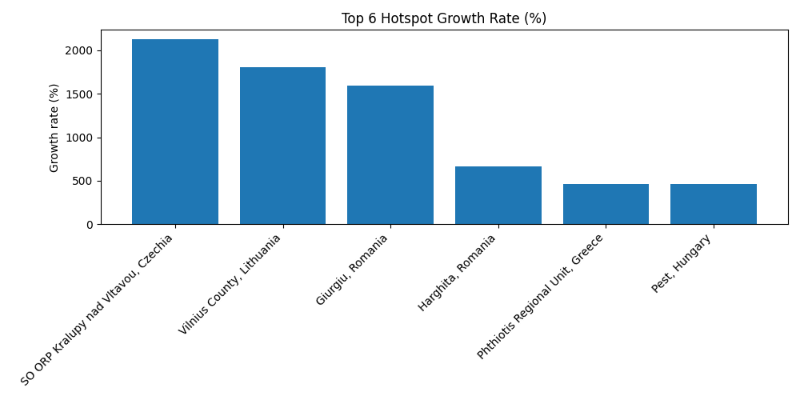

# REGIONÁLIS BIZTONSÁGPOLITIKAI HELYZETJELENTÉS
# REGIONAL SECURITY SITUATION REPORT

## Visual Overview

### Top Hotspot Growth Rate

Balkán – Közép- és Kelet-Európa – Közel-Kelet  
Balkans – Central and Eastern Europe – Middle East  

Készítés dátuma: 2026-09-28  
Date of issue: 2026-09-28  

Terjesztés: Nyilvános elemzés  
Distribution: Public analysis  

Készítette: toresvonalak.blog  
Prepared by: toresvonalak.blog  

---

# 1. Vezetői összefoglaló
## Executive Summary

Az aktuális ciklusban a monitoring rendszer **673 biztonsági relevanciájú eseményt** azonosított a vizsgált régiókban. A Balkánból **493**, Közép- és Kelet-Európából **6**, a Közel-Kelethez kapcsolódó streamből pedig **174** tétel került a rendszerbe.

In the current cycle, the monitoring system identified **673 security-relevant items** across the observed regions. Of these, **493** were linked to the Balkans, **6** to Central and Eastern Europe, and **174** to the Middle East stream.

Az összkép alapján nem egyetlen domináns válságpont rajzolódik ki, hanem több párhuzamos nyomáspont: politikai polarizáció, lokalizált biztonsági incidensek, információs nyomásgyakorlás és stratégiai bizonytalanság.

The overall picture does not suggest a single dominant crisis point, but rather multiple parallel pressure areas: political polarization, localized security incidents, information pressure and strategic uncertainty.

**Balkán:** A Nyugat-Balkán biztonsági helyzete az elmúlt héten összességében fokozódó feszültségekkel terhelt képet mutatott. A térségben zajló folyamatokat továbbra is politikai instabilitás, biztonságpolitikai és katonai… A jelenlegi folyamatok rövid távon nem utalnak fegyveres konfliktus közvetlen kockázatára, ugyanakkor több ponton emelkedő eszkalációs nyomás érzékelhető. A legfőbb kockázatot továbbra is az alacsony intenzitású, de…

**Balkans:** A Nyugat-Balkán biztonsági helyzete az elmúlt héten összességében fokozódó feszültségekkel terhelt képet mutatott. A térségben zajló folyamatokat továbbra is politikai instabilitás, biztonságpolitikai és katonai… A jelenlegi folyamatok rövid távon nem utalnak fegyveres konfliktus közvetlen kockázatára, ugyanakkor több ponton emelkedő eszkalációs nyomás érzékelhető. A legfőbb kockázatot továbbra is az alacsony intenzitású, de…

**Közép- és Kelet-Európa:** A helyi forrásokból érkező infrastruktúra- és biztonsági jelzések alapján a heti lokális nyomás legerősebben itt jelent meg: Estonia: 2.6. A közép– és kelet-európai térség biztonsági helyzete az elmúlt héten összességében mérsékelten romló képet mutatott. A regionális dinamikát elsősorban politikai instabilitás és kormányzati feszültségek, határbiztonsági…

**Central and Eastern Europe:** A helyi forrásokból érkező infrastruktúra- és biztonsági jelzések alapján a heti lokális nyomás legerősebben itt jelent meg: Estonia: 2.6. A közép– és kelet-európai térség biztonsági helyzete az elmúlt héten összességében mérsékelten romló képet mutatott. A regionális dinamikát elsősorban politikai instabilitás és kormányzati feszültségek, határbiztonsági…

A jelenlegi trendek alapján rövid távon inkább tartós, alacsonyabb intenzitású, de politikailag érzékeny biztonsági környezet valószínűsíthető, mintsem hirtelen, minden térséget egyszerre érintő eszkaláció.

Current trends suggest a persistent, lower-intensity but politically sensitive security environment in the short term, rather than a sudden simultaneous escalation across all theatres.

---

# 2. Aktuális biztonsági helyzet
## Current Security Situation

### Politikai környezet / Political Environment

A térség politikai rendszerei formális stabilitást mutatnak, ugyanakkor több országban erősödik a polarizáció, a társadalmi mobilizáció és a belpolitikai feszültségek biztonsági hatása.

Political systems across the monitored regions show formal stability, yet polarization, social mobilization and the security effects of domestic tensions are becoming more visible in several states.

### Katonai és biztonsági helyzet / Military and Security Situation

Balkán régióban azonosított események száma: **493**  
Közép- és Kelet-Európában azonosított események száma: **6**  
Közel-Kelethez kapcsolódó azonosított események száma: **174**

Az incidensek többsége továbbra is alacsony vagy közepes intenzitású biztonsági fejleményekhez, politikai feszültségekhez, lokalizált gócpontokhoz vagy stratégiai jelentőségű híralapú eseményekhez kapcsolódik.

Most detected items remain linked to low- or medium-intensity security developments, political tensions, localized hotspots or strategically relevant news-based events.

### Közel-Kelet / Middle East

A monitoring rendszer az aktuális időszakban **174 közel-keleti eseményt** azonosított. Az események túlnyomó része hírforrásokon alapuló regionális jelzésként értelmezhető.

The monitoring system identified **174 Middle East-related events** in the current dataset. Most items can be interpreted as news-based regional signals.

#### Kiemelt események / Highlighted events

**Iran Update, September 27, 2026**  
Dátum: **2026-09-27** | Helyszín: **Iran** | Forrás: **ISW**  
Az esemény **általános monitoring jelzés** kategóriába sorolható, és a monitoring rendszer **0.78** bizalmi szint mellett kezelte. A rendelkezésre álló összefoglaló alapján ez egy **egyéb regionális fejlemény**, amely hozzájárul a térség folyamatos stratégiai bizonytalanságához. The Institute for the Study of War (ISW) and The Critical Threats Project (CTP) at the American Enterprise Institute are publishing updates Monday through Friday to provide analysis on the war with Iran. Most updates cover events from the past 24-hour period, whereas Monday updates also include events from the preceding weekend, collec...

**Iran Update, September 27, 2026**  
Date: **2026-09-27** | Location: **Iran** | Source: **ISW**  
This event can be classified as a **general monitoring signal**, and it was handled by the monitoring system with a confidence level of **0.78**. Based on the available summary, this is a **other** development contributing to the region's continued strategic uncertainty. The Institute for the Study of War (ISW) and The Critical Threats Project (CTP) at the American Enterprise Institute are publishing updates Monday through Friday to provide analysis on the war with Iran. Most updates cover events from the past 24-hour period, whereas Monday updates also include events from the preceding weekend, collec...

**Iran Update, September 26, 2026**  
Dátum: **2026-09-26** | Helyszín: **Iran** | Forrás: **ISW**  
Az esemény **általános monitoring jelzés** kategóriába sorolható, és a monitoring rendszer **0.78** bizalmi szint mellett kezelte. A rendelkezésre álló összefoglaló alapján ez egy **egyéb regionális fejlemény**, amely hozzájárul a térség folyamatos stratégiai bizonytalanságához. The Institute for the Study of War (ISW) and The Critical Threats Project (CTP) at the American Enterprise Institute are publishing updates Monday through Friday to provide analysis on the war with Iran. Most updates cover events from the past 24-hour period, whereas Monday updates also include events from the preceding weekend, collec...

**Iran Update, September 26, 2026**  
Date: **2026-09-26** | Location: **Iran** | Source: **ISW**  
This event can be classified as a **general monitoring signal**, and it was handled by the monitoring system with a confidence level of **0.78**. Based on the available summary, this is a **other** development contributing to the region's continued strategic uncertainty. The Institute for the Study of War (ISW) and The Critical Threats Project (CTP) at the American Enterprise Institute are publishing updates Monday through Friday to provide analysis on the war with Iran. Most updates cover events from the past 24-hour period, whereas Monday updates also include events from the preceding weekend, collec...

**Iran Update, September 25, 2026**  
Dátum: **2026-09-25** | Helyszín: **Iran** | Forrás: **ISW**  
Az esemény **általános monitoring jelzés** kategóriába sorolható, és a monitoring rendszer **0.78** bizalmi szint mellett kezelte. A rendelkezésre álló összefoglaló alapján ez egy **egyéb regionális fejlemény**, amely hozzájárul a térség folyamatos stratégiai bizonytalanságához. The Institute for the Study of War (ISW) and the Critical Threats Project (CTP) at the American Enterprise Institute are publishing daily updates to provide analysis on developments in the Middle East over the past 24-hour period. Note: ISW-CTP will begin publishing abbreviated weekend updates covering the Houthi-Saudi conflict beginni...

**Iran Update, September 25, 2026**  
Date: **2026-09-25** | Location: **Iran** | Source: **ISW**  
This event can be classified as a **general monitoring signal**, and it was handled by the monitoring system with a confidence level of **0.78**. Based on the available summary, this is a **other** development contributing to the region's continued strategic uncertainty. The Institute for the Study of War (ISW) and the Critical Threats Project (CTP) at the American Enterprise Institute are publishing daily updates to provide analysis on developments in the Middle East over the past 24-hour period. Note: ISW-CTP will begin publishing abbreviated weekend updates covering the Houthi-Saudi conflict beginni...

---

# 3. Geopolitikai környezet
## Geopolitical Environment

A térség geopolitikai jelentősége abból fakad, hogy stratégiai energia-, kereskedelmi és politikai útvonalak találkozási pontjában helyezkedik el. A jelenlegi dinamikát a nagyhatalmi versengés, a regionális biztonsági architektúra változásai és a gazdasági alkalmazkodóképesség kérdései alakítják.

The geopolitical relevance of the broader area stems from its position along strategic energy, trade and political corridors. Current dynamics are shaped by great-power competition, changing security architectures and questions of economic resilience.

---

# 4. Fő biztonsági kihívások
## Main Security Challenges

A legjelentősebb kockázatot jelenleg az jelenti, hogy több térségben egyszerre jelentkeznek politikai, gazdasági, információs és biztonsági természetű kihívások. A hibrid hadviselés elemei, különösen az információs műveletek és a kibertérhez kapcsolódó sérülékenységek, továbbra is fontos kockázati tényezők.

The most significant current risk lies in the simultaneous presence of political, economic, information and security pressures across multiple monitored areas. Hybrid elements, especially information operations and cyber-related vulnerabilities, remain important risk factors.

---

# 5. Régiós értelmezés
## Regional Analytical Context

### Balkán

**Nyugat-Balkán heti biztonsági brief**

A Nyugat-Balkán biztonsági helyzete az elmúlt héten összességében fokozódó feszültségekkel terhelt képet mutatott. A térségben zajló folyamatokat továbbra is politikai instabilitás, biztonságpolitikai és katonai érzékenységek, kritikus infrastruktúrához kapcsolódó sérülékenységek határozzák meg. A vizsgált időszakban nem történt olyan esemény, amely alapjaiban változtatta volna meg a régió biztonsági dinamikáját, ugyanakkor lokális incidensek és eszkalációs kockázatok megfigyelhetők voltak.
 
Szerbia: Szerbia esetében a belpolitikai folyamatok továbbra is jelentős hatást gyakorolnak a…

A Nyugat-Balkán biztonsági helyzete az elmúlt héten összességében fokozódó feszültségekkel terhelt képet mutatott. A térségben zajló folyamatokat továbbra is politikai instabilitás, biztonságpolitikai és katonai érzékenységek, kritikus infrastruktúrához kapcsolódó sérülékenységek határozzák meg. A vizsgált időszakban nem történt olyan esemény, amely alapjaiban változtatta volna meg a régió biztonsági dinamikáját, ugyanakkor lokális incidensek és eszkalációs kockázatok megfigyelhetők voltak.
 
Szerbia: Szerbia esetében a belpolitikai folyamatok továbbra is jelentős hatást gyakorolnak a…

A régióban mért összesített heti eseménymennyiség: **493**. A legmagasabb súlyozott országkitettségek: **Albania (40.3), Kosovo (31.2), Bosnia and Herzegovina (24.9)**.

Total weekly event volume in the region: **493**. Highest weighted country exposures: **Albania (40.3), Kosovo (31.2), Bosnia and Herzegovina (24.9)**.

Forrásösszetétel: GDELT: 482, RSS: 11.

Source composition: GDELT: 482, RSS: 11.

**Kockázati értékelés:** A jelenlegi folyamatok rövid távon nem utalnak fegyveres konfliktus közvetlen kockázatára, ugyanakkor több ponton emelkedő eszkalációs nyomás érzékelhető. A legfőbb kockázatot továbbra is az alacsony intenzitású, de tartós politikai krízisek jelentik. A dezinformációs tevékenység és a polarizált médiakörnyezet növeli a társadalmi feszültségeket.

**Risk assessment:** A jelenlegi folyamatok rövid távon nem utalnak fegyveres konfliktus közvetlen kockázatára, ugyanakkor több ponton emelkedő eszkalációs nyomás érzékelhető. A legfőbb kockázatot továbbra is az alacsony intenzitású, de tartós politikai krízisek jelentik. A dezinformációs tevékenység és a polarizált médiakörnyezet növeli a társadalmi feszültségeket.

**Rövid távú előretekintés:** Rövid távon nem várható jelentős változás a biztonsági helyzetben, azonban a jelenlegi trendek fennmaradása esetén fokozatos romlás valószínűsíthető. A következő időszak kulcskérdése a szerb–koszovói párbeszéd alakulása lesz. A nemzetközi közösség szerepvállalása továbbra is elengedhetetlen a status quo fenntartásához.

**Short-term outlook:** Rövid távon nem várható jelentős változás a biztonsági helyzetben, azonban a jelenlegi trendek fennmaradása esetén fokozatos romlás valószínűsíthető. A következő időszak kulcskérdése a szerb–koszovói párbeszéd alakulása lesz. A nemzetközi közösség szerepvállalása továbbra is elengedhetetlen a status quo fenntartásához.

### Közép- és Kelet-Európa

**Közép–Kelet-Európa heti biztonsági brief**

A közép– és kelet-európai térség biztonsági helyzete az elmúlt héten összességében mérsékelten romló képet mutatott. A regionális dinamikát elsősorban politikai instabilitás és kormányzati feszültségek, határbiztonsági és rendészeti nyomás, energetikai és kritikus infrastruktúra-kitettség határozták meg. A vizsgált időszakban nem történt olyan egyedi esemény, amely alapjaiban alakította volna át a teljes térség biztonsági szerkezetét, ugyanakkor lokális incidensek és eszkalációs kockázatok több ponton megfigyelhetők voltak.
 
Hungary: Magyarország esetében a heti jelzések alapján a…

A közép– és kelet-európai térség biztonsági helyzete az elmúlt héten összességében mérsékelten romló képet mutatott. A regionális dinamikát elsősorban politikai instabilitás és kormányzati feszültségek, határbiztonsági és rendészeti nyomás, energetikai és kritikus infrastruktúra-kitettség határozták meg. A vizsgált időszakban nem történt olyan egyedi esemény, amely alapjaiban alakította volna át a teljes térség biztonsági szerkezetét, ugyanakkor lokális incidensek és eszkalációs kockázatok több ponton megfigyelhetők voltak.
 
Hungary: Magyarország esetében a heti jelzések alapján a…

A régióban mért összesített heti eseménymennyiség: **6**. A legmagasabb súlyozott országkitettségek: **Hungary (44.3), Poland (9.5), Lithuania (6.3)**.

Total weekly event volume in the region: **6**. Highest weighted country exposures: **Hungary (44.3), Poland (9.5), Lithuania (6.3)**.

Forrásösszetétel: DIRECT_FEED: 6.

Source composition: DIRECT_FEED: 6.

**Kockázati értékelés:** A jelenlegi folyamatok rövid távon nem utalnak széles körű fegyveres eszkaláció közvetlen kockázatára, ugyanakkor több ponton emelkedő nyomás érzékelhető. A legfőbb kockázatot továbbra is a határbiztonsági incidensek, az energetikai sérülékenységek, a dezinformáció és a belpolitikai polarizáció együttes hatása jelenti. A magas érzékenységű peremterületeken a lokális nyomáspontok gyorsan regionális figyelmet…

**Risk assessment:** A jelenlegi folyamatok rövid távon nem utalnak széles körű fegyveres eszkaláció közvetlen kockázatára, ugyanakkor több ponton emelkedő nyomás érzékelhető. A legfőbb kockázatot továbbra is a határbiztonsági incidensek, az energetikai sérülékenységek, a dezinformáció és a belpolitikai polarizáció együttes hatása jelenti. A magas érzékenységű peremterületeken a lokális nyomáspontok gyorsan regionális figyelmet…

**Rövid távú előretekintés:** Rövid távon nem várható a regionális helyzet gyökeres átalakulása, ugyanakkor több törékeny politikai és biztonságpolitikai dinamika továbbra is fennmarad. A következő időszak kulcskérdése várhatóan az energia- és belpolitikai sérülékenységek összekapcsolódása lesz. Az események folyamatos monitorozása továbbra is indokolt, különösen a magas érzékenységű határtérségekben és az energetikai kapcsolódási pontokon.

**Short-term outlook:** Rövid távon nem várható a regionális helyzet gyökeres átalakulása, ugyanakkor több törékeny politikai és biztonságpolitikai dinamika továbbra is fennmarad. A következő időszak kulcskérdése várhatóan az energia- és belpolitikai sérülékenységek összekapcsolódása lesz. Az események folyamatos monitorozása továbbra is indokolt, különösen a magas érzékenységű határtérségekben és az energetikai kapcsolódási pontokon.

---

# 5/A. Regionális hotspotok
## Regional Hotspots

### Balkán
**Regional Unit of East Attica, Greece**  
Az elmúlt időszak fejleményei alapján Regional Unit of East Attica, Greece térségében növekvő aktivitás figyelhető meg. A monitoring rendszer korlátozott, de releváns aktivitást azonosított, az aktivitásváltozás mértéke **431.9%**, míg a hotspot intenzitási pontszáma **29.479**. A jelenlegi jelzések elsődlegesen **hír- és politikai-biztonsági monitorozási jelzés** formájában jelentkeznek.  
Jelzés típusa: **Politikai / biztonsági incidensjelzés / Political-security incident signal**. A rövid távú kilátások alapján a térség továbbra is releváns fókuszpont maradhat a regionális monitoring számára.

**Regional Unit of East Attica, Greece**  
Recent developments suggest that an upward trend in activity can be observed in the Regional Unit of East Attica, Greece area. The monitoring system detected limited but relevant activity, while the change in activity reached **431.9%** and the hotspot intensity score stands at **29.479**. Current signals are primarily identified as **news and political-security monitoring signal**.  
Signal type: **Politikai / biztonsági incidensjelzés / Political-security incident signal**. Based on current trends, the location is likely to remain a relevant focal point for regional monitoring in the short term.

**Phthiotis Regional Unit, Greece**  
Az elmúlt időszak fejleményei alapján Phthiotis Regional Unit, Greece térségében növekvő aktivitás figyelhető meg. A monitoring rendszer korlátozott, de releváns aktivitást azonosított, az aktivitásváltozás mértéke **396.8%**, míg a hotspot intenzitási pontszáma **17.012**. A jelenlegi jelzések elsődlegesen **hír- és politikai-biztonsági monitorozási jelzés** formájában jelentkeznek.  
Jelzés típusa: **Politikai / biztonsági incidensjelzés / Political-security incident signal**. A rövid távú kilátások alapján a térség továbbra is releváns fókuszpont maradhat a regionális monitoring számára.

**Phthiotis Regional Unit, Greece**  
Recent developments suggest that an upward trend in activity can be observed in the Phthiotis Regional Unit, Greece area. The monitoring system detected limited but relevant activity, while the change in activity reached **396.8%** and the hotspot intensity score stands at **17.012**. Current signals are primarily identified as **news and political-security monitoring signal**.  
Signal type: **Politikai / biztonsági incidensjelzés / Political-security incident signal**. Based on current trends, the location is likely to remain a relevant focal point for regional monitoring in the short term.

**Jász-Nagykun-Szolnok, Hungary**  
Az elmúlt időszak fejleményei alapján Jász-Nagykun-Szolnok, Hungary térségében növekvő aktivitás figyelhető meg. A monitoring rendszer korlátozott, de releváns aktivitást azonosított, az aktivitásváltozás mértéke **407.5%**, míg a hotspot intenzitási pontszáma **13.616**. A jelenlegi jelzések elsődlegesen **hír- és politikai-biztonsági monitorozási jelzés** formájában jelentkeznek.  
Jelzés típusa: **Politikai / biztonsági incidensjelzés / Political-security incident signal**. A rövid távú kilátások alapján a térség továbbra is releváns fókuszpont maradhat a regionális monitoring számára.

**Jász-Nagykun-Szolnok, Hungary**  
Recent developments suggest that an upward trend in activity can be observed in the Jász-Nagykun-Szolnok, Hungary area. The monitoring system detected limited but relevant activity, while the change in activity reached **407.5%** and the hotspot intensity score stands at **13.616**. Current signals are primarily identified as **news and political-security monitoring signal**.  
Signal type: **Politikai / biztonsági incidensjelzés / Political-security incident signal**. Based on current trends, the location is likely to remain a relevant focal point for regional monitoring in the short term.

### Közép- és Kelet-Európa
**Kutno County, Poland**  
Az elmúlt időszak fejleményei alapján Kutno County, Poland térségében újonnan megjelent aktivitás rajzolódik ki. A monitoring rendszer korlátozott, de releváns aktivitást azonosított, az aktivitásváltozás mértéke **n.a.**, míg a hotspot intenzitási pontszáma **2.829**. A jelenlegi jelzések elsődlegesen **közvetlen feed-alapú incidensjelzés** formájában jelentkeznek.  
Jelzés típusa: **Feed-alapú incidensgóc / Direct-feed incident hotspot**. A rövid távú kilátások alapján a térség továbbra is releváns fókuszpont maradhat a regionális monitoring számára.

**Kutno County, Poland**  
Recent developments suggest that newly emerging activity is visible in the Kutno County, Poland area. The monitoring system detected limited but relevant activity, while the change in activity reached **n.a.** and the hotspot intensity score stands at **2.829**. Current signals are primarily identified as **direct-feed based incident signal**.  
Signal type: **Feed-alapú incidensgóc / Direct-feed incident hotspot**. Based on current trends, the location is likely to remain a relevant focal point for regional monitoring in the short term.

**SO ORP Kralupy nad Vltavou, Czechia**  
Az elmúlt időszak fejleményei alapján SO ORP Kralupy nad Vltavou, Czechia térségében újonnan megjelent aktivitás rajzolódik ki. A monitoring rendszer korlátozott, de releváns aktivitást azonosított, az aktivitásváltozás mértéke **n.a.**, míg a hotspot intenzitási pontszáma **0.449**. A jelenlegi jelzések elsődlegesen **közvetlen feed-alapú incidensjelzés** formájában jelentkeznek.  
Jelzés típusa: **Feed-alapú incidensgóc / Direct-feed incident hotspot**. A rövid távú kilátások alapján a térség továbbra is releváns fókuszpont maradhat a regionális monitoring számára.

**SO ORP Kralupy nad Vltavou, Czechia**  
Recent developments suggest that newly emerging activity is visible in the SO ORP Kralupy nad Vltavou, Czechia area. The monitoring system detected limited but relevant activity, while the change in activity reached **n.a.** and the hotspot intensity score stands at **0.449**. Current signals are primarily identified as **direct-feed based incident signal**.  
Signal type: **Feed-alapú incidensgóc / Direct-feed incident hotspot**. Based on current trends, the location is likely to remain a relevant focal point for regional monitoring in the short term.

**Pest, Hungary**  
Az elmúlt időszak fejleményei alapján Pest, Hungary térségében újonnan megjelent aktivitás rajzolódik ki. A monitoring rendszer korlátozott, de releváns aktivitást azonosított, az aktivitásváltozás mértéke **n.a.**, míg a hotspot intenzitási pontszáma **0.305**. A jelenlegi jelzések elsődlegesen **közvetlen feed-alapú incidensjelzés** formájában jelentkeznek.  
Jelzés típusa: **Feed-alapú incidensgóc / Direct-feed incident hotspot**. A rövid távú kilátások alapján a térség továbbra is releváns fókuszpont maradhat a regionális monitoring számára.

**Pest, Hungary**  
Recent developments suggest that newly emerging activity is visible in the Pest, Hungary area. The monitoring system detected limited but relevant activity, while the change in activity reached **n.a.** and the hotspot intensity score stands at **0.305**. Current signals are primarily identified as **direct-feed based incident signal**.  
Signal type: **Feed-alapú incidensgóc / Direct-feed incident hotspot**. Based on current trends, the location is likely to remain a relevant focal point for regional monitoring in the short term.

---

# 6. Kockázatelemzés
## Risk Assessment

| Fenyegetés | Valószínűség | Hatás | Kockázati szint |
|---|---|---|---|
| Határincidensek | magas | közepes | magas |
| Politikai instabilitás | közepes | magas | magas |
| Hibrid műveletek | magas | közepes | magas |
| Nagyhatalmi versengés | közepes | magas | magas |
| Energiapiaci zavarok | közepes | magas | magas |

| Threat | Probability | Impact | Risk level |
|---|---|---|---|
| Border incidents | high | medium | high |
| Political instability | medium | high | high |
| Hybrid operations | high | medium | high |
| Great-power competition | medium | high | high |
| Energy-market disruption | medium | high | high |

---

# 7. Előrejelzés
## Forecast

A jelenlegi trendek alapján rövid távon fennmaradhat az alacsonyabb intenzitású, de tartós biztonsági nyomás, miközben a Közel-Kelethez kapcsolódó fejlemények közvetett hatást gyakorolhatnak a tágabb regionális környezetre. A geopolitikai rivalizálás erősödése miatt a vizsgált térség továbbra is stratégiai jelentőségű biztonsági tér marad.

Current trends suggest that lower-intensity but persistent security pressure is likely to continue in the short term, while developments linked to the Middle East may continue to shape the broader environment indirectly. As geopolitical rivalry intensifies, the monitored space is likely to remain strategically relevant.

---

# 8. Ajánlások
## Recommendations

A regionális stabilitás fenntartása érdekében a következő lépések javasoltak:

- a határ menti katonai kommunikáció erősítése  
- a bizalomépítő intézkedések kiterjesztése  
- a dezinformáció elleni együttműködés növelése  
- a gazdasági stabilitást támogató nemzetközi programok bővítése  
- az energiabiztonsági kitettségek folyamatos monitorozása  

To support regional stability, the following steps are recommended:

- strengthen cross-border military communication  
- expand confidence-building measures  
- increase cooperation against disinformation  
- broaden international programs supporting economic resilience  
- continuously monitor energy-security vulnerabilities  

---

# 9. Módszertan és adatforrások
## Methodology and Data Sources

A jelentés automatizált monitoring rendszerekből származó adatok feldolgozásán alapul. A jelenlegi verzió heti összesítésekre, hotspot-jelzésekre és a Közel-Kelethez kapcsolódó eseménylistákra épül. A brief kiegészítő elemző szövegeket is felhasznál, amennyiben azok elérhetők a régiós weekly állományokban.

This report is based on automated monitoring outputs. The current version relies on weekly aggregation files, hotspot signal summaries and Middle East event lists. Where available, the brief also uses analytical text fields from regional weekly files.

Adatforrások / Data sources:

- Balkan Security Map  
- CEE Security Map  
- Middle East Security Monitor

